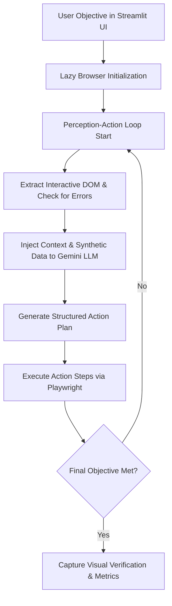

# MCP Autonomous QA Automation Framework
An enterprise-grade, self-healing web agent and MCP-style host loop for automated application testing.

---

## 📋 Project Overview
The **MCP Autonomous QA Automation Framework** is an advanced, perception-action loop driven web automation driver. It exposes specialized web-driving capabilities—combining Playwright, a custom form-aware visual DOM layout scraper, and a Faker synthetic data factory—to Gemini LLM reasoning engines. The framework functions as a Model Context Protocol (MCP) host, allowing high-level natural language objectives to drive complete, end-to-end user workflows with zero manual script creation.

---

## 🏛️ Universal App Architecture
The framework is designed to work across a wide variety of target environments without hardcoding step-by-step selectors. 



### Key Architectural Concepts:
1. **Dynamic Authentication Parsing**: The agent dynamically parses login pages and authenticates using secure static admin credentials. If the application is already logged in, it automatically skips the login phase and moves straight to the target dashboard.
2. **Flexible DOM Scraping**: The custom scraper analyzes the active viewport to isolate interactive elements (`input`, `select`, `textarea`, `button`, etc.), extracting names, labels, and placeholders to map interactive states without reliance on static XPath/CSS patterns.
3. **Lazy Browser Provisioning**: To save compute and prevent local environment clutter, the Playwright browser context is lazily loaded. Starting the UI does not boot the driver; the browser engine launches only when an automation task is explicitly submitted in the conversational UI.

---

## ⚙️ Setup Instructions

### 1. Prerequisites
- Python 3.10 or higher installed on your system.
- Node.js (required by Playwright to initialize browsers).

### 2. Environment Configuration
Create a `.env` file in the root directory to store your API credentials:
```env
GEMINI_API_KEY=your_gemini_api_key_here
```

### 3. Dependency Unification (One-Step Sync)
The package requirements are locked to guarantee cross-platform consistency. Use the following commands to initialize a virtual environment and synchronize dependencies:

```bash
# 1. Create Python virtual environment
python -m venv .venv

# 2. Activate virtual environment
# On Windows:
.venv\Scripts\activate
# On macOS/Linux:
source .venv/bin/activate

# 3. Synchronize unified dependencies
pip install -r requirements.txt

# 4. Provision Playwright Chromium binaries
playwright install chromium
```

---

## 🚀 Execution Instructions

The framework enforces a **UI-First** launch sequence:

### 1. Start the Streamlit Host UI
Launch the conversational control panel from your terminal:
```bash
streamlit run app_ui.py
```
This launches the host dashboard on `http://localhost:8501`.

### 2. Run an Objective
1. Open the dashboard in your web browser.
2. Adjust environment variables, override URLs, or credentials in the sidebar if needed.
3. Type a high-level goal in the chat box at the bottom (e.g., `"Log into the system and completely add a new employee profile, ensuring no mandatory field is left blank."`).
4. Click submit. The agent will lazily spin up the chromium driver in the background, showing a live terminal telemetry stream of its thoughts and interactions directly in the UI.

---

## 🛠️ Enterprise Features

### 1. Exhaustive Form Completion Engine
When the agent navigates to data-entry screens, it scans the layout for mandatory fields (marked with `*` or asterisk indicators). The framework enforces that **every empty visible field** must be completed using context-aware fallbacks or the synthetic data pool prior to submission, avoiding form validation rejects.

### 2. Runtime Self-Healing Fallback
If the application rejects a form due to database constraints or validation issues (e.g. "Work email and personal email cannot be the same" or "username already exists"):
1. The framework's **Visual and Text-based Error Scraper** isolates the warning message.
2. The error text is injected back into the LLM context.
3. The Faker data generator refreshes conflicting parameters (generating fresh emails/usernames/numbers).
4. The LLM re-analyzes, uses the alternative pool variables, clears the conflicting fields, and attempts submission again in runtime without crashing the execution loop.

### 3. Automated Telemetry Dashboard
Upon completion or step exhaustion, the host logs a structured **QA Execution Executive Summary** containing:
- **Target Goal**
- **Total Steps Taken**
- **Execution Status**
- **Artifacts Path Listing** (screenshots and proofs)
- **Visual State Proof** (renders the final screen inside the Streamlit UI)