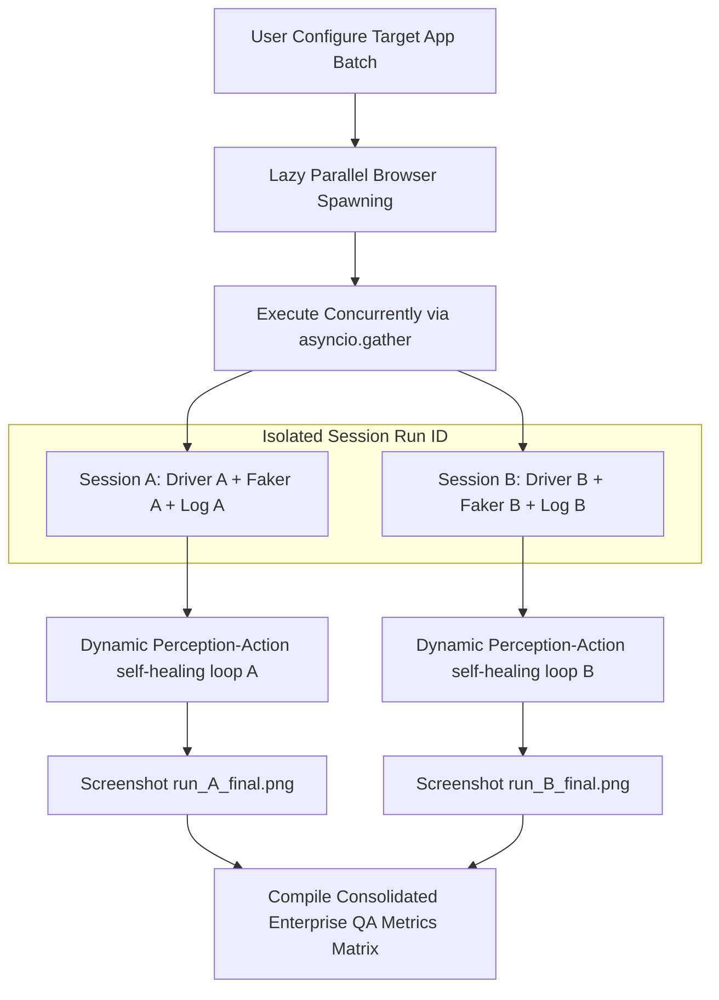

# Parallel AI Automation Suite
An enterprise-grade, self-healing web agent and autonomous runner loop for automated parallel application testing.

---

## 📋 Project Overview
The **Parallel AI Automation Suite** is an advanced, perception-action loop driven web automation driver. It exposes specialized web-driving capabilities—combining Playwright, a custom form-aware visual DOM layout scraper, and a Faker synthetic data factory—to Gemini LLM reasoning engines. The framework functions as an autonomous automation driver, allowing high-level natural language objectives to drive complete, end-to-end user workflows in parallel across multiple isolated application targets.

---

## 🏛️ Universal App Architecture
The framework is designed to work across a wide variety of target environments without hardcoding step-by-step selectors.



### Key Architectural Concepts:
1. **Dynamic Authentication Parsing**: The agent dynamically parses login pages and authenticates using secure static admin credentials. If the application is already logged in, it automatically skips the login phase and moves straight to the target dashboard.
2. **Flexible DOM Scraping**: The custom scraper analyzes the active viewport to isolate interactive elements (`input`, `select`, `textarea`, `button`, etc.), extracting names, labels, and placeholders to map interactive states without reliance on static XPath/CSS patterns.
3. **Lazy Browser Provisioning**: To save compute and prevent local environment clutter, the Playwright browser context is lazily loaded. Starting the UI does not boot the driver; the browser engine launches only when an automation task is explicitly submitted in the conversational UI.
4. **Asynchronous Browser Concurrency**: The execution engine utilizes Python's `asyncio.gather` to concurrently manage multiple independent browser sessions. Each running target operates in its own dedicated Playwright context, page instance, and Faker synthetic data generator, completely eliminating thread cross-contamination.

---

## ⚙️ Setup Instructions

### 1. Prerequisites
- Python 3.10 or higher installed on your system.
- Node.js (required by Playwright to initialize browsers).

### 2. Environment Configuration
Create a `.env` file in the root directory to store your API credentials:
```env
GEMINI_API_KEY=your_gemini_api_key_here
```

### 3. Dependency Unification (One-Step Sync)
The package requirements are locked to guarantee cross-platform consistency. Use the following commands to initialize a virtual environment and synchronize dependencies:

```bash
# 1. Create Python virtual environment
python -m venv .venv

# 2. Activate virtual environment
# On Windows:
.venv\Scripts\activate
# On macOS/Linux:
source .venv/bin/activate

# 3. Synchronize unified dependencies
pip install -r requirements.txt

# 4. Provision Playwright Chromium binaries
playwright install chromium
```

---

## 🚀 Execution Instructions

The framework enforces a **UI-First** launch sequence:

### 1. Start the Streamlit Host UI
Launch the conversational control panel from your terminal:
```bash
streamlit run app_ui.py
```
This launches the host dashboard on `http://localhost:8501`.

### 2. Run Test Suite Objectives
1. Open the dashboard in your web browser.
2. Configure targets dynamically in the main area (click **➕ Add App Target** to add as many targets as required, specify their name, target URL, and individual goal objectives).
3. Select the desired **Browser Visibility** in the sidebar (Headed or Headless).
4. Click **🚀 Run Test Suite**.
5. Live logging is rendered concurrently. Streamlit dynamically maps isolated tabs for each application execution showing status blocks, distinct real-time console streams, and visual screenshots upon completion.

---

## 🛠️ Enterprise Features

### 1. Multi-Application Concurrency Suite
The framework dynamically spawns separate browser runners to execute completely different test profiles concurrently (e.g. running an internal administration employee creation workflow on App A while verifying dashboard accessibility on App B).

### 2. Isolated Telemetry and Visual Artifact Tracking
Logs and screenshots are isolated per execution branch to prevent race conditions:
- Telemetry logs are routed through isolated callbacks to distinct UI output widgets.
- Screenshots are keyed using unique run identifiers: `screenshots/run_{run_id}_step_{step}_{timestamp}.png` and copied to `screenshots/run_{run_id}_final.png` upon completion.

### 3. Exhaustive Form Completion Engine
When the agent navigates to data-entry screens, it scans the layout for mandatory fields (marked with `*` or asterisk indicators). The framework enforces that **every empty visible field** must be completed using context-aware fallbacks or the synthetic data pool prior to submission, avoiding form validation rejects.

### 4. Runtime Self-Healing Fallback
If the application rejects a form due to database constraints or validation issues (e.g. "Work email and personal email cannot be the same" or "Unable to log in"):
1. The framework's **Visual and Text-based Error Scraper** isolates the warning message.
2. The error text is injected back into the LLM context.
3. The Faker data generator refreshes conflicting parameters (generating fresh emails/usernames/numbers).
4. The LLM re-analyzes, uses the alternative pool variables, clears the conflicting fields, and attempts submission again in runtime without crashing the execution loop.

### 5. Consolidated Enterprise Status Report
Upon completion of the parallel runs, the framework aggregates metrics from all branches into a single consolidated execution matrix displayed in the Streamlit UI and console:

```markdown
| Target App | URL | Status | Steps Taken | Duration (s) | Final State | Screenshot Path |
| :--- | :--- | :--- | :--- | :--- | :--- | :--- |
| Optimworks Employee Add | https://dev.urbuddi.com/login | SUCCESS | 4 | 57.09 | True | screenshots/run_optimworks_employee_add_final.png |
| Moodle Admin Verify | https://sandbox.moodledemo.net/login/index.php | SUCCESS | 11 | 104.68 | True | screenshots/run_moodle_admin_verify_final.png |
```